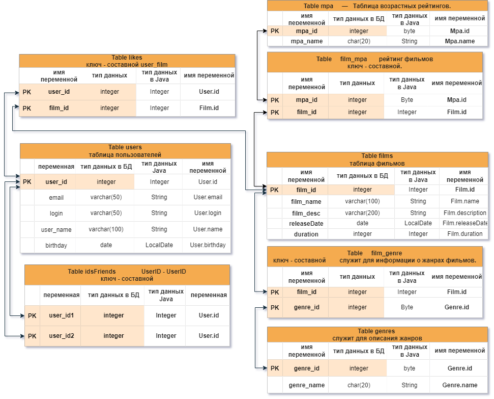

# `java-filmorate`
Template repository for `Filmorate` project.

##Sprint 11 Final. round 1.   
###Film
####Добавьте новое свойство — «жанр».  
У фильма может быть сразу несколько жанров, а у поля — несколько значений. Например, таких:  
* Комедия.
* Драма.
* Мультфильм.
* Триллер.
* Документальный.
* Боевик.

####Ещё одно свойство — рейтинг Ассоциации кинокомпаний (англ. Motion Picture Association, сокращённо МРА).   
Эта оценка определяет возрастное ограничение для фильма. Значения могут быть следующими:
* `G` — у фильма нет возрастных ограничений,
* `PG` — детям рекомендуется смотреть фильм с родителями,
* `PG-13` — детям до 13 лет просмотр не желателен,
* `R` — лицам до 17 лет просматривать фильм можно только в присутствии взрослого,
* `NC-17` — лицам до 18 лет просмотр запрещён.  

###User
Добавьте статус для связи «дружба» между двумя пользователями:
* неподтверждённая — когда один пользователь отправил запрос на добавление другого пользователя в друзья,
* подтверждённая — когда второй пользователь согласился на добавление.
###Создание схемы базы данных   
Начните с таблиц для хранения пользователей и фильмов. При проектировании помните о том, что:
   1. Каждый столбец таблицы должен содержать только одно значение.
   2. Хранить массивы значений или вложенные записи в столбцах нельзя.
   3. Все неключевые атрибуты должны однозначно определяться ключом.
   4. Все неключевые атрибуты должны зависеть только от первичного ключа, а не от других неключевых атрибутов.
   5. База данных должна поддерживать бизнес-логику предусмотренную в приложении.   
      Подумайте о том, как будет происходить получение всех фильмов, пользователей. А как — топ N наиболее популярных фильмов. Или список общих друзей с другим пользователем.

###Теперь нарисуйте схему базы данных.   
**На рисунке дополнительно отображены переменные Java-программы, которые будут связаны с БД.**  

  ##Sprint 10 Final. round 2.  
###Проект сдан и имеет следующий функционал:
* Новая архитектура приложения.
* Закомментированы файлы тестов контроллеров.
* Обработка ошибок с помощью ExceptionHandler.
* Юзеры добавляются и удаляются из друзей.
* Фильмам ставятся и удаляются лайки.
* Тесты Mockito так и не настроены.

#Финальный проект спринта 10.
##Техническое задание.
Настало время улучшить `Filmorate`. Чтобы составлять рейтинг фильмов, нужны отзывы пользователей. А для улучшения 
рекомендаций по просмотру хорошо бы объединить пользователей в комьюнити.  
По итогам прошлого спринта у вас получилась заготовка приложения. 
Программа может принимать, обновлять и возвращать пользователей и фильмы.  
В этот раз улучшим `API` приложения до соответствия `REST`, а также изменим архитектуру приложения 
с помощью внедрения зависимостей.  
####Наводим порядок в репозитории:  
* Для начала убедитесь в том, что ваша работа за предыдущий спринт слита с главной веткой main. 
* Создайте новую ветку, которая будет называться `add-friends-likes`.  
* Название ветки важно сохранить, потому что оно влияет на запуск тестов в GitHub.  
###Подсказка: про работу в `Git`.
Для слияния веток используйте команду merge.
##Архитектура:
Начнём с переработки архитектуры.  
Сейчас вся логика приложения спрятана в контроллерах — изменим это. Вынесите хранение данных 
о фильмах и пользователях в отдельные классы. Назовём их «хранилищами» (англ. `storage`) — так 
будет сразу понятно, что они делают.
* Создайте интерфейсы `FilmStorage` и `UserStorage`, в которых будут определены методы добавления, 
удаления и модификации объектов.
* Создайте классы `InMemoryFilmStorage` и `InMemoryUserStorage`, имплементирующие новые интерфейсы, 
и перенесите туда всю логику хранения, обновления и поиска объектов.
* Добавьте к `InMemoryFilmStorage` и `InMemoryUserStorage` аннотацию `@Component,` чтобы 
впоследствии пользоваться внедрением зависимостей и передавать хранилища сервисам.
###Подсказка: про структуру проекта.
Чтобы объединить хранилища, создайте новый пакет storage. В нём будут только классы и интерфейсы, 
имеющие отношение к хранению данных. Например, `ru.yandex.filmorate.storage.film.FilmStorage`.

##Новая логика.
Пока у приложения нет никакой бизнес-логики, кроме валидации сущностей. Обеспечим возможность 
пользователям добавлять друг друга в друзья и ставить фильмам лайки.
* Создайте `UserService`, который будет отвечать за такие операции с пользователями, 
как добавление в друзья, удаление из друзей, вывод списка общих друзей. 
Пока пользователям не надо одобрять заявки в друзья — добавляем сразу. 
То есть если Лена стала другом Саши, то это значит, что Саша теперь друг Лены.
* Создайте `FilmService`, который будет отвечать за операции с фильмами, — добавление и 
удаление лайка, вывод 10 наиболее популярных фильмов по количеству лайков. Пусть пока каждый 
пользователь может поставить лайк фильму только один раз.
* Добавьте к ним аннотацию `@Service` — тогда к ним можно будет получить доступ из контроллера.
###Подсказка: ещё про структуру.
По аналогии с хранилищами, объедините бизнес-логику в пакет `service`.
###Подсказка: про список друзей и лайки.
Есть много способов хранить информацию о том, что два пользователя являются друзьями. Например, 
можно создать свойство `friends` в классе пользователя, которое будет содержать список его друзей. 
Вы можете использовать такое решение или придумать своё. Для того чтобы обеспечить уникальность 
значения (мы не можем добавить одного человека в друзья дважды), проще всего использовать для 
хранения `Set<Long>` с `id` друзей. Таким же образом можно обеспечить условие «один пользователь — 
один лайк» для оценки фильмов.
###Зависимости.
Переделайте код в контроллерах, сервисах и хранилищах под использование внедрения зависимостей.
* Используйте аннотации `@Service`, `@Component`, `@Autowired`. Внедряйте зависимости через 
конструкторы классов.
* Классы-сервисы должны иметь доступ к классам-хранилищам. Убедитесь, что сервисы зависят от 
интерфейсов классов-хранилищ, а не их реализаций. Таким образом в будущем будет проще добавлять 
и использовать новые реализации с другим типом хранения данных.
* Сервисы должны быть внедрены в соответствующие контроллеры.

###Подсказка: `@Service vs @Component`.
`@Component` — аннотация, которая определяет класс как управляемый Spring. Такой класс будет 
добавлен в контекст приложения при сканировании.  
`@Service` не отличается по поведению, но обозначает более узкий спектр классов — такие, 
которые содержат в себе бизнес-логику и, как правило, не хранят состояние.
##Полный `REST`.
Дальше стоит заняться контроллерами и довести `API` до соответствия `REST`.
* С помощью аннотации `@PathVariable` добавьте возможность получать каждый фильм и данные о 
пользователях по их уникальному идентификатору: `GET .../users/{id}`.
* Добавьте методы, позволяющие пользователям добавлять друг друга в друзья, получать список 
общих друзей и лайкать фильмы. Проверьте, что все они работают корректно.
* `PUT /users/{id}/friends/{friendId}` — добавление в друзья.
* `DELETE /users/{id}/friends/{friendId}` — удаление из друзей.
* `GET /users/{id}/friends` — возвращаем список пользователей, являющихся его друзьями.
* `GET /users/{id}/friends/common/{otherId}` — список друзей, общих с другим пользователем.
* `PUT /films/{id}/like/{userId}` — пользователь ставит лайк фильму.
* `DELETE /films/{id}/like/{userId}` — пользователь удаляет лайк.
* `GET /films/popular?count={count}` — возвращает список из первых count фильмов по количеству 
лайков. Если значение параметра `count` не задано, верните первые 10.
* Убедитесь, что ваше приложение возвращает корректные `HTTP`-коды.
* `400` — если ошибка валидации: `ValidationException`;
* `404` — для всех ситуаций, если искомый объект не найден;
* `500` — если возникло исключение.
###Подсказка:
Настройте `ExceptionHandler` для централизованной обработки ошибок.
##Тестирование
Убедитесь, что приложение работает, — протестируйте его с помощью Postman: postman.json.  

Ого! Оцените, как `Filmorate` быстро растёт, — все компоненты занимают свои места, проявляется 
настоящая бизнес-логика. Любители кино потирают руки. Удачной разработки!

#Некоторые алгоритмы работы программы:
###    Обновление пользователя.
    Пользователь есть в БД по логину?
       да: {
            ID не равен null или совпадает с ID из БД   {
                если ID пользователя == null   {
                    присваиваем ID из БД пользователю.
                    обновляем запись в БД.
                    Return Ok.
                } иначе {
                    если ID совпадает с ID из БД {
                        обновляем запись в БД.
                        Return Ok.
                    } иначе {
                        Bad Request 500, Not Found 404
                    }
                }
            }
       Нет: {
            если нет ID {
                присваиваем сгенерированный ID;
                вносим в БД
                return OK.
            } иначе если ID есть в БД {
                обновление логина пользователя.
                обновляем запись в БД.
            } иначе если ID нет в БД {
                Bad Request 500, Not Found 404
            }
        }
